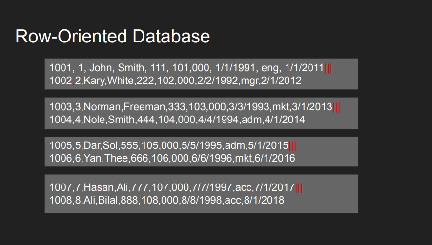
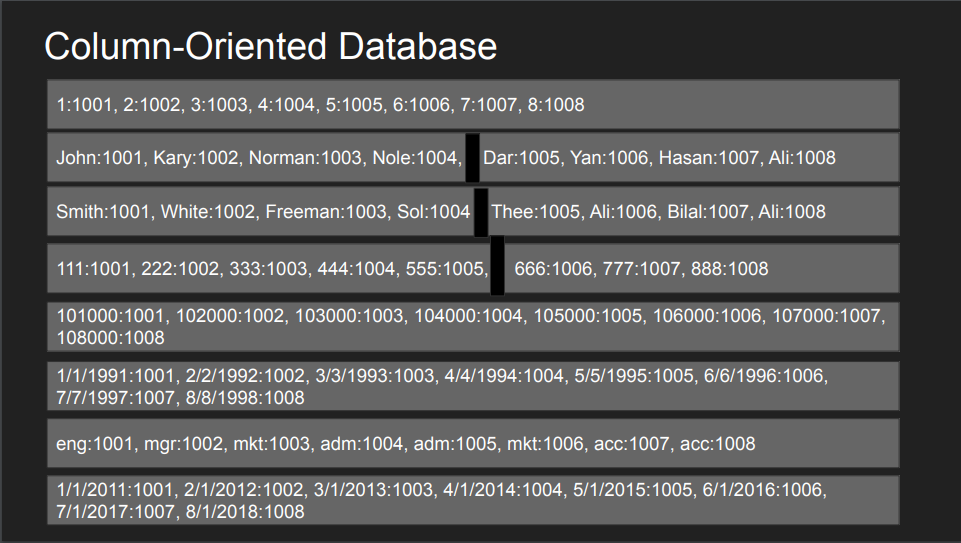

## Database Engine
- Library that takes care of disk operation and CRUD operation
- DMBS can use the DB engine to build features like Replication, Isolation on top of the Engine
- If you want don't start from scrath instead use on of the engines
- Sometime referred as Storage Engine or Embedded Engine

## Row-Based vs Column-Based DB

### Row-Oriented DB
- Tables are stored as row in disk
- **A single block IO read to the table fetches multiple rows with all the columns.**
- More IOs are required to find a particular row in a table scan but once you find the row you get all columns for that row

### Column-Oriented DB
- Tables are stored as column first in disk
- **A single block IO red to the table fetches multiple columns with all the matching rows.**
- Less IOs are required to get more values of a given columns. But working with multiple columns require more IOs

### Pros and Cons
|Row Based|Column Based|
|--|--|
| Optimal for read/writes | Writes are slower |
| OLTP | OLAP |
| Compression isn't efficient | Compress greatly|
| Aggregation ins't efficient | Amazing for Aggregation|
| Efficient for multi-column reads | Inefficient |
