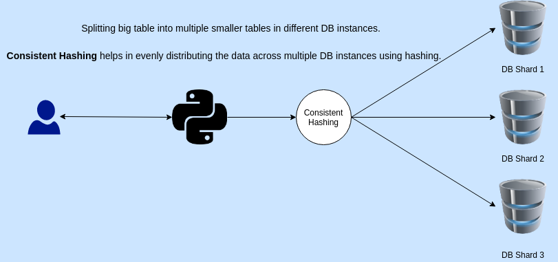

### Sharding
Splitting big table into multiple smaller tables in **different DB instances**.

### Consistent Hashing
It helps in evenly distributing the data across multiple DB instances using hashing. Sharding is just one of the applications of the CH.

### Pros
- Scalibility
  - Data
  - Memory
- Security (users can access certain shards)
- Optimal and smaller index size

### Cons
- Complex client
- Transactions across shards problem
- Rollbacks
- Schema changes are hard
- Joins
- Has to be something you know in the query
